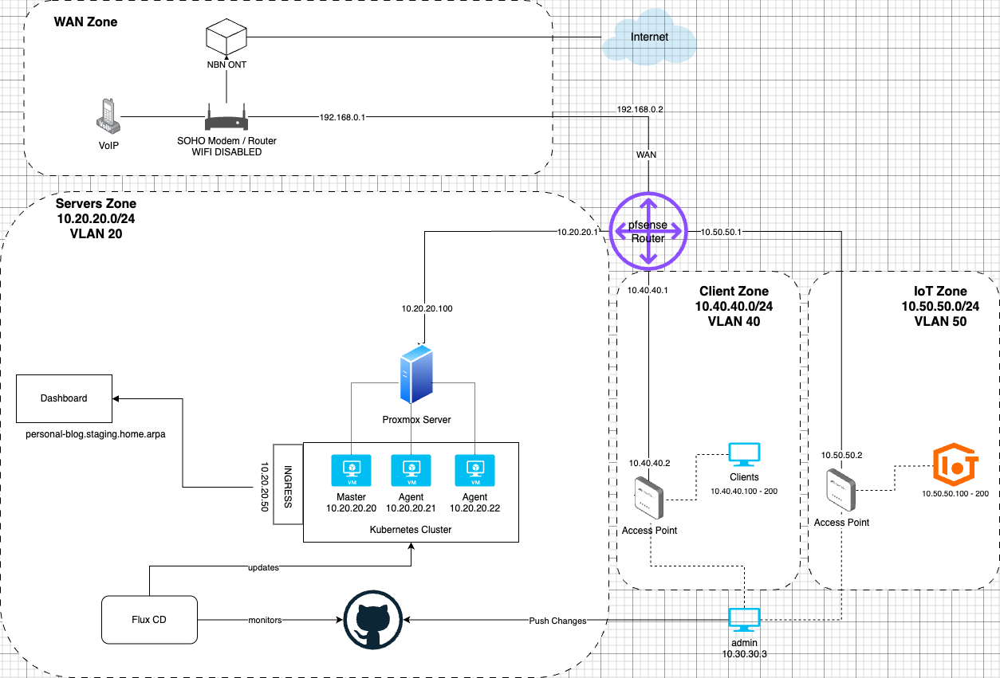

# HomeLab - Kubernetes Cluster Setup

This repository documents my HomeLab setup using Kubernetes (k3s) as a way to deepen my computer networking knowledge. The setup includes both automated scripts and manual steps for deployment and management.

## Table of Contents

- [Hardware Setup](#hardware-setup)
- [Network Configuration](#network-configuration)
  - [VLAN Management](#vlan-management)
  - [Double NAT Configuration](#double-nat-configuration)
- [Virtualization](#virtualization)
  - [Proxmox Setup](#proxmox-setup)
- [Kubernetes Cluster](#kubernetes-cluster)
  - [Server Node Setup](#server-node-setup)
  - [Agent Node Setup](#agent-node-setup)
  - [Flux Setup](#flux-setup)
  - [Ingress Configuration](#ingress-configuration)
- [Application Deployment](#application-deployment)
- [Troubleshooting](#troubleshooting)

## Hardware Setup

Currently running on three Ubuntu 22.04 LTS VMs on a Macbook Pro M1.

## Network Configuration

### VLAN Management

[Add your VLAN configuration details here]



### Double NAT Configuration

[Add details about your double NAT setup with WiFi modem connected to pfSense router]

## Virtualization

### Proxmox Setup

[Add your Proxmox configuration details here]

## Kubernetes Cluster

### Server Node Setup

#### Using Automated Script (Recommended)

1. SSH into your server VM
2. Run the setup script:

```bash
scp setup-k3s-server.sh user@server-ip:/tmp/script.sh
ssh -tt user@server-ip 'bash /tmp/script.sh'
```

The script will:

- Install k3s server
- Set up kubeconfig
- Create necessary namespaces
- Install and configure Flux
- Set up GitHub Container Registry authentication

#### Manual Setup Steps

1. SSH into your server VM
2. Install k3s server:

```bash
curl -sfL https://get.k3s.io | sh -
```

3. Set up kubeconfig:

```bash
sudo mkdir ~/.kube
sudo cp /etc/rancher/k3s/k3s.yaml ~/.kube/config.yaml
chown $USER:$USER ~/.kube/config.yaml
chmod 600 ~/.kube/config.yaml
```

4. Export kubeconfig path:

```bash
export KUBECONFIG=~/.kube/config.yaml
```

### Agent Node Setup

#### Using Automated Script (Recommended)

1. SSH into your agent VM
2. Run the setup script:

```bash
scp setup-k3s-agent.sh user@agent-ip:/tmp/script.sh
ssh -tt user@agent-ip 'bash /tmp/script.sh'
```

The script will:

- Install k3s agent
- Connect to the server node
- Set up necessary configurations

#### Manual Setup Steps

1. Get the node token from the server:

```bash
export K3S_TOKEN=$(ssh user@$SERVER_IP "sudo -S cat /var/lib/rancher/k3s/server/node-token")
```

2. Install k3s agent:

```bash
curl -sfL https://get.k3s.io | K3S_URL=https://$SERVER_IP:6443 K3S_TOKEN=$K3S_TOKEN sh -
```

3. Copy kubeconfig from server to agent:

```bash
scp ~/.kube/config.yaml user@agent-ip:~/.kube/config.yaml
```

4. Export kubeconfig path on agent:

```bash
export KUBECONFIG=~/.kube/config.yaml
```

### Flux Setup

#### Using Automated Script (Recommended)

1. Create a GitHub personal access token with appropriate permissions
2. The server setup script will automatically:
   - Install Flux
   - Bootstrap your repository
   - Configure image automation controllers
   - Set up GitHub Container Registry authentication

#### Manual Setup Steps

1. Create a GitHub personal access token
2. Install Flux:

```bash
curl -s https://fluxcd.io/install.sh | sudo bash
export GITHUB_TOKEN=$TOKEN
```

3. Bootstrap Flux with GitHub:

```bash
flux bootstrap github \
    --owner=$GITHUB_USER \
    --repository=home-lab \
    --branch=main \
    --path=clusters/flux-system \
    --components-extra=image-reflector-controller,image-automation-controller \
    --personal
```

4. Install additional Flux components:

```bash
flux install --components-extra=image-reflector-controller,image-automation-controller
```

5. Configure GitHub Registry Authentication:

```bash
kubectl create secret docker-registry ghcr-credentials \
    --namespace=web \
    --docker-server=ghcr.io \
    --docker-username=$GITHUB_USERNAME \
    --docker-password=$GITHUB_TOKEN
```

### Ingress Configuration

My current understanding is that Ingress acts as a type of load balancer. K3S default is to use Trafaek, I thought it more useful to become more familiar with the more popular Nginx plus I've read from others that it tends to work 'better'. In the cloud environment the below install should work out of the box however on baremetal an externally accessible (external to the cluster) ip is no automatically allocated, therefore the option that i went with is the MetalLB which adds allows this to work somehow - I'll update when i know how this works.

1. Run `kubectl apply -f https://raw.githubusercontent.com/kubernetes/ingress-nginx/controller-v1.12.1/deploy/static/provider/cloud/deploy.yaml` which will install the ingress-nginx-controller. See here for more information: `https://kubernetes.github.io/ingress-nginx/deploy/?ref=blog.thenets.org#bare-metal`
2. The above creates a number of pods and it will take some time before the controller is read. You can check the status by running the following: `kubectl get pods --namespace=ingress-nginx`
3. Once it runs then you can provide the controller with information about how to navigate to your apps service. See `clusters/stating/apps/web/personal-blog/ingress.yaml' as an example.
4. Because this isn't enough to create an accessible IP (from outside the cluster) I've installed MetalLB: `kubectl apply -f https://raw.githubusercontent.com/metallb/metallb/v0.14.9/config/manifests/metallb-native.yaml`
5. This also requires configuration: see `clusters/staging/metallb-system/metallb-config.yaml`. This uses a port range which is relevant to your network configuration - this needs to be an ip range that are not part of the dhcp pool. NOTE: I have `flux cd` set up so when i push these changes up it's automatically applied locally, otherwise you would `apply` the file.
6. More information available here about installing MetalLB: `https://metallb.universe.tf/installation/` - NOTE: you'll need to edit the nginx-ingress-controller if using Kube-Proxy in IPVS mode - I'm not clear on what that is, but I suspect you would know if you set this up.
7. Now if you run `kubectl get svc ingress-nginx-controller -n ingress-nginx` you should now have an eternal-ip.
8. One final step is to locally map the hostname, in my case `personal-blog.staging.local` in your `/etc/hosts` file to the ip address that was allocated.

## Application Deployment

Applications are deployed using the following workflow:

1. Push application code to GitHub
2. GitHub Actions builds and pushes Docker image to GHCR
3. Flux detects new image and updates deployment
4. Image automation controllers handle version updates

Image naming convention for GHCR:

```
ghcr.io/github-user-name/name-of-container:version
```

For each image that will be updated, you'll need to create the following manifests:

- ImageRepository
- ImagePolicy
- ImageUpdateAutomation

## Troubleshooting

### Useful kubectl Commands

```bash
# Check cluster status
kubectl get nodes
kubectl get pods -A
kubectl get namespaces

# Check Flux components
kubectl get deployments -n flux-system
kubectl get crds | grep image.toolkit.fluxcd.io
kubectl get gitrepositories -A
kubectl get events -n flux-system
flux get sources git

# Reconcile Flux
flux reconcile kustomization <your-kustomization-name>

# Debugging
kubectl get secrets -n namespace
kubectl logs pod-name -n namespace
kubectl describe pod pod-name -n namespace
sudo journalctl -u k3s -f

# Ingress
kubectl get service ingress-nginx-controller -n ingress-nginx

```

### Uninstallation

#### Using Scripts

```bash
# Server uninstallation
scp uninstall-k3s.sh user@server-ip:/tmp/script.sh
ssh -tt user@server-ip 'bash /tmp/script.sh'

# Agent uninstallation
scp uninstall-k3s-agent.sh user@agent-ip:/tmp/script.sh
ssh -tt user@agent-ip 'bash /tmp/script.sh'
```

#### Manual Uninstallation

```bash
# Server uninstallation
sudo /usr/local/bin/k3s-uninstall.sh
```

## Notes

- Ensure proper architecture compatibility (ARM64) when building images
- GitHub Actions builds should include multi-platform support:
  ```yaml
  with:
    platforms: linux/arm64, linux/amd64
  ```
- For image automation issues, check:
  ```bash
  kubectl get deployments -n flux-system
  kubectl get crds | grep image.toolkit.fluxcd.io
  ```

### Possible Issues

1. ````lewi0231@ubuntu-sol:~$ flux get sources git
   ✗ failed to get server groups: Get "http://localhost:8080/api": dial tcp [::1]:8080: connect: connection refused```
   ````

-
